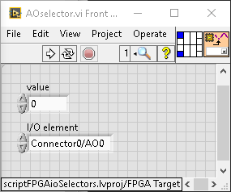
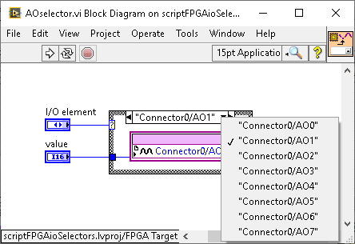
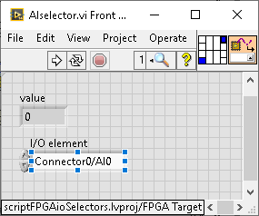
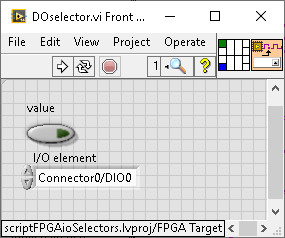
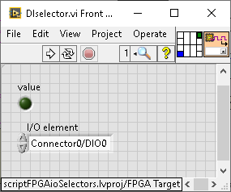

# Creating FPGA I/O nodes accessors by scripting

A limitation of LabVIEW FPGA coding is that FPGA I/O nodes assigments must be declared in the IDE at edit time.
The functionality of reading from or writing to an I/O node, whose assigment is known only at runtime, is not
supported. The question has been asked for instance
[here](https://forums.ni.com/t5/LabVIEW/Programmatically-selecting-Digital-IO-at-run-time-on-FPGA/td-p/682669) and [here](https://stackoverflow.com/questions/31296571/labview-programmatically-setting-fpga-i-o-variables-templates).

The only way to work around the limitation, and to achieve a sort of dynamical assigmnent at runtime, which I have
found, would be to create gigantic case structures, in which the desired I/O terminal is picked up among all
possible with the aid of an input selector.

Creating such case structures is obviously tedious in the IDE by clicking and dragging, and VI scripting is
called for. Unfortunately [FPGA scripting](https://lavag.org/topic/16684-fpga-scripting/) is essentially
[unsupported](https://lavag.org/topic/19564-use-scripting-on-fpga-interface-readwrite-control/?do=findComment&comment=118158)
and [undocumented](https://forums.ni.com/t5/LabVIEW/Using-VI-Scripting-to-generate-FPGA-VI/m-p/3989927/highlight/true#M1138482),
and Elementary I/O nodes scripting (what is called here for), even less.

By mining and a lot of trial attempt, I managed to do it, though.
This small project exemplifies how generic I/O accessor VIs can be created
by means of undocumented LabVIEW scripting VIs (and a few tricks, like cutting and repasting an incomplete
diagram in order to auto-fix what I haven't found other way to set correctly).

## Instructions:

In the project **scriptFPGAioSelectors.lvproj**, I have added an FPGA target, in my case a PCIe-7852R.
YMMV depending on LabVIEW version and its hardware support. You may have to ditch it and create it anew.
If so, take care to create, inside the Target, virtual folders for all the I/O connectors you intend to use
(right click _New/FPGA I/O_, and add Resources, checking _Place new I/O in folders_). I assumed that the
default names (like _Connector0/AI0_ etc.) are left unchanged.

Now run **MainScriptCreateAllIOselectors.vi**. This will create four new VIS (or update them), and three
enum typedefs. The generated VIS are the read and write case accessors for respectively all AI, all AO,
all DI and all DO; the typedef'd enum controls allow to select the right case.

To use the generated VIs in real FPGA code, you'd want to duplicate them inside the FPGA target virtual folder.

Further comments are written on the BD of the various subVIs where relevant.

In the project I've also included a broken **NoDynamicIOref.vi** which exemplifies why things, unfortunately,
cannot be coded the easy way.

The project has been created and tested on LabVIEW 2014 being the latest one supporting the legacy FPGA
card of interest.